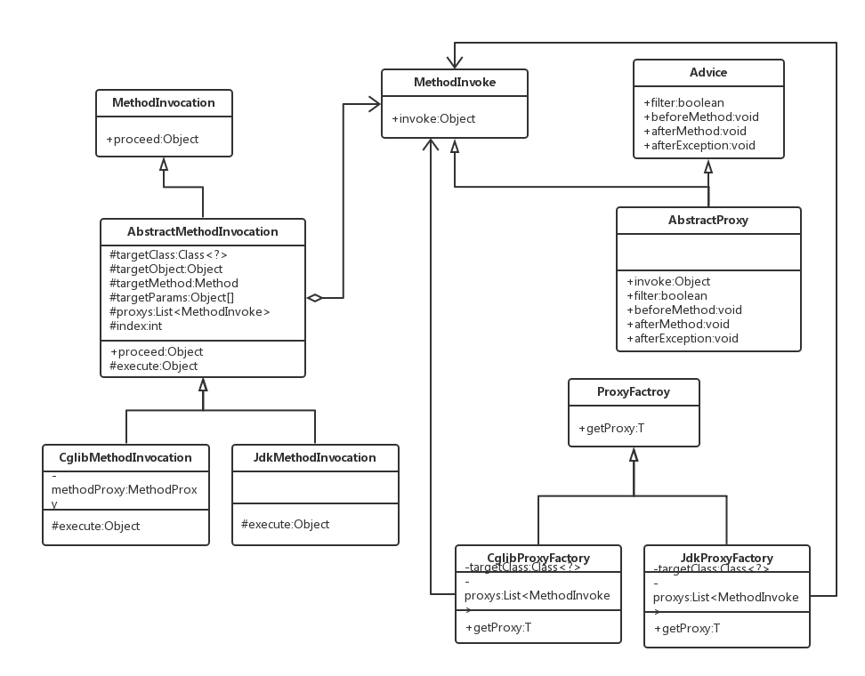

# java-chowder Java小杂烩

## excel
利用`POI`实现`Excel`导入及导出工具

## proxy
使用`Jdk`反射和`Cglib`实现`AOP`

类图：

## ioc
模拟基于`annotation`的ioc容器

## template
1. `Hibernate`通用模板类

## transfer
1. 利用`commons-fileupload`和`NIO`实现简单的文件传输

## qrcode
利用`qrgen`生成二维码
